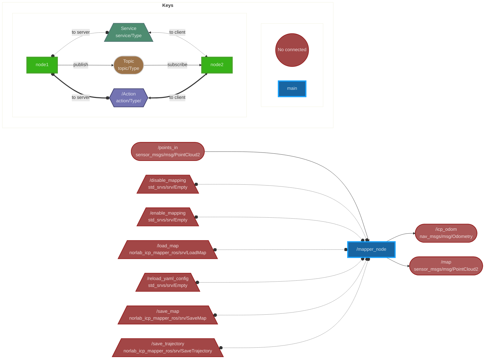

# norlab_icp_mapper_ros
A bridge between [norlab_icp_mapper](https://github.com/norlab-ulaval/norlab_icp_mapper/) and ROS.
Check the [mapper's documentation](https://norlab-icp-mapper.readthedocs.io/en/latest/UsingInRos/) for a detailed guide.

## Node Parameters
|               Name                |                                                 Description                                                 |        Possible values         |                       Default Value                        |
|:---------------------------------:|:-----------------------------------------------------------------------------------------------------------:|:------------------------------:|:----------------------------------------------------------:|
|            odom_frame             |                                          Frame used for odometry.                                           |           Any string           |                           "odom"                           |
|            robot_frame            |                                        Frame centered on the robot.                                         |           Any string           |                        "base_link"                         |
|          mapping_config           |                               Path to the file containing the mapping config.                               |         Any file path          |                             ""                             |
|       initial_map_file_name       |                           Path of the file from which the initial map is loaded.                            |         Any file path          |                             ""                             |
|        initial_robot_pose         | Transformation matrix in homogeneous coordinates describing the initial pose of the robot in the map frame. | Any matrix of dimension 3 or 4 | "[[1, 0, 0, 0], [0, 1, 0, 0], [0, 0, 1, 0], [0, 0, 0, 1]]" |
|        final_map_file_name        |                  Path of the file in which the final map is saved when is_online is false.                  |         Any file path          |                         "map.vtk"                          |
|    final_trajectory_file_name     |              Path of the file in which the final trajectory is saved when is_online is false.               |         Any file path          |                      "trajectory.vtk"                      |
|         map_publish_rate          |      Rate at which the map is published (in Hertz). It can be slower depending on the map update rate.      |             (0, ∞)             |                            10.0                            |
|        map_tf_publish_rate        |                              Rate at which the map tf is published (in Hertz).                              |             (0, ∞)             |                            10.0                            |
|           max_idle_time           |           Delay to wait being idle before shutting down ROS when is_online is false (in seconds).           |             [0, ∞)             |                            10.0                            |
|            is_mapping             |                  true when map updates are wanted, false when only localization is wanted.                  |         {true, false}          |                            true                            |
|             is_online             |                            true when online mapping is wanted, false otherwise.                             |         {true, false}          |                            true                            |
|   save_map_cells_on_hard_drive    |      true when map cell storage on hard drive is wanted, false when map cell storage in RAM is wanted.      |         {true, false}          |                            true                            |
| publish_tfs_between_registrations |      When false, the map tf is published only after registration. Otherwise with map_tf_publish_rate.       |         {true, false}          |                            true                            |

## Node Topics
|   Name    |                     Description                     |
| :-------: | :-------------------------------------------------: |
| points_in |  Topic from which the input points are retrieved.   |
|    map    |        Topic in which the map is published.         |
| icp_odom  | Topic in which the corrected odometry is published. |

## Node Services
|        Name        |          Description          | Parameter Name |               Parameter Description                |
| :----------------: |:-----------------------------:| :------------: | :------------------------------------------------: |
|      save_map      |    Saves the current map.     |    filename    |    Path of the file in which the map is saved.     |
|  save_trajectory   | Saves the current trajectory. |    filename    | Path of the file in which the trajectory is saved. |
| reload_yaml_config | Reload the YAML config file.  |                |                                                    |

## Mapper Node Graph

